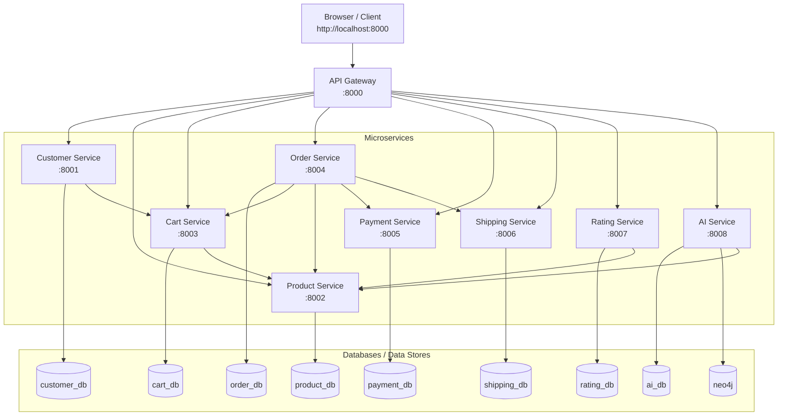

# 📚 ProductStore Microservices

## Giới thiệu

ProductStore là một ứng dụng web bán sách trực tuyến được xây dựng theo **kiến trúc Microservices**. Hệ thống gồm **8 services** độc lập, mỗi service chịu trách nhiệm một nghiệp vụ riêng biệt, giao tiếp với nhau thông qua **REST API** (Synchronous Communication).

---

## 🛠 Công nghệ sử dụng

| Công nghệ | Mô tả | Phiên bản |
|-----------|-------|-----------|
| **Python** | Ngôn ngữ lập trình chính | 3.x |
| **Django** | Web framework cho mỗi microservice | 4.x |
| **Django REST Framework** | Xây dựng REST API cho các services | 3.x |
| **MySQL** | Hệ quản trị CSDL quan hệ | 8.0 |
| **Docker** | Container hóa các services | Latest |
| **Docker Compose** | Điều phối multi-container | Latest |
| **HTML/CSS/JavaScript** | Giao diện người dùng (Frontend) | — |
| **Gunicorn** | WSGI HTTP Server cho production | Latest |
| **PyMySQL** | MySQL client cho Python | Latest |

### Tại sao chọn các công nghệ này?

- **Django + DRF**: Phù hợp cho việc xây dựng REST API nhanh chóng với ORM mạnh mẽ, serializer tự động, và hệ thống authentication sẵn có.
- **MySQL**: Hệ quản trị CSDL ổn định, phổ biến, phù hợp cho dữ liệu có cấu trúc rõ ràng (sách, đơn hàng, khách hàng).
- **Docker + Docker Compose**: Giúp mỗi service chạy trong container riêng biệt, dễ dàng deploy, scale, và đảm bảo tính nhất quán giữa các môi trường.
- **Kiến trúc Microservices**: Cho phép phát triển, deploy, và scale từng service độc lập.

---

## 🏗 Kiến trúc hệ thống



> **Mỗi service có database riêng** (Database per Service pattern) — đảm bảo tính độc lập và loose coupling giữa các services.

---

## 📦 Chi tiết từng Service

### 1. API Gateway (Port 8000)

**Vai trò**: Điểm truy cập duy nhất (Single Entry Point) cho toàn bộ hệ thống. Nhận request từ client, điều phối tới service phù hợp.

**Chức năng**:
- **Server-Side Rendering (SSR)**: Render giao diện HTML bằng Django Template Engine
- **Proxy API**: Forward JSON request từ client tới các internal services
- **Session Management**: Quản lý phiên đăng nhập (lưu token, customer_id, is_staff vào session)
- **Data Enrichment**: Gộp dữ liệu từ nhiều services (VD: giỏ hàng + thông tin sách)

**Giao tiếp với**: Tất cả 7 services còn lại

| API Endpoint | Method | Mô tả |
|-------------|--------|-------|
| `/` | GET | Trang chủ |
| `/auth/register/` | GET, POST | Đăng ký tài khoản |
| `/auth/login/` | GET, POST | Đăng nhập |
| `/auth/logout/` | GET | Đăng xuất |
| `/products/` | GET | Danh sách sách |
| `/products/<id>/` | GET | Chi tiết sách + đánh giá |
| `/products/<id>/rate/` | POST | Đánh giá sách |
| `/my-cart/` | GET | Xem giỏ hàng |
| `/add-to-cart/<product_id>/` | POST | Thêm sách vào giỏ |
| `/update-cart-item/<id>/` | POST | Cập nhật số lượng |
| `/remove-cart-item/<id>/` | POST | Xóa item khỏi giỏ |
| `/checkout/` | GET | Trang thanh toán |
| `/place-order/` | POST | Đặt hàng |
| `/orders/` | GET | Lịch sử đơn hàng |
| `/staff/products/` | GET, POST | Quản lý sách (staff) |
| `/staff/products/edit/<id>/` | POST | Sửa sách (staff) |
| `/staff/products/delete/<id>/` | POST | Xóa sách (staff) |

---

### 2. Customer Service (Port 8001)

**Vai trò**: Quản lý tài khoản khách hàng và xác thực.

**Database**: `customer_db`

**Models**:
- **Customer**: `id`, `user (FK → Django User)`, `name`, `email`, `created_at`
- **Django User**: Sử dụng Django Auth User model cho authentication

**Chức năng**:
- Đăng ký tài khoản (tạo User + Customer + auto tạo Cart)
- Đăng nhập (authenticate + trả về Token)
- Phân biệt role: `is_staff` (nhân viên) vs customer (khách hàng)

**Giao tiếp với**: Cart Service (tạo giỏ hàng khi đăng ký)

| API Endpoint | Method | Mô tả |
|-------------|--------|-------|
| `/auth/register/` | POST | Đăng ký (body: name, email, password) |
| `/auth/login/` | POST | Đăng nhập (body: email, password) |
| `/customers/` | GET, POST | CRUD khách hàng |

---

### 3. Product Service (Port 8002)

**Vai trò**: Quản lý thông tin sách (catalog).

**Database**: `product_db`

**Model**:
- **Product**: `id`, `title`, `author`, `price`, `stock`, `created_at`

**Chức năng**:
- **CRUD đầy đủ**: Thêm / Sửa / Xóa / Xem sách
- Cung cấp thông tin giá sách cho các service khác

| API Endpoint | Method | Mô tả |
|-------------|--------|-------|
| `/products/` | GET | Danh sách tất cả sách |
| `/products/` | POST | Thêm sách mới |
| `/products/<id>/` | GET | Chi tiết sách |
| `/products/<id>/` | PUT | Cập nhật sách |
| `/products/<id>/` | DELETE | Xóa sách |

---

### 4. Cart Service (Port 8003)

**Vai trò**: Quản lý giỏ hàng của khách hàng.

**Database**: `cart_db`

**Models**:
- **Cart**: `id`, `customer_id`, `created_at`
- **CartItem**: `id`, `cart (FK → Cart)`, `product_id`, `quantity`

**Chức năng**:
- Tạo giỏ hàng cho customer
- Thêm / Sửa / Xóa item trong giỏ
- Kiểm tra sách tồn tại trước khi thêm (gọi Product Service)

**Giao tiếp với**: Product Service (validate product_id)

| API Endpoint | Method | Mô tả |
|-------------|--------|-------|
| `/carts/` | POST | Tạo giỏ hàng mới |
| `/carts/<customer_id>/` | GET | Xem giỏ hàng theo customer |
| `/cart-items/` | POST | Thêm item vào giỏ |
| `/cart-items/<id>/` | PUT | Cập nhật số lượng |
| `/cart-items/<id>/` | DELETE | Xóa item |

---

### 5. Order Service (Port 8004)

**Vai trò**: Xử lý đặt hàng — service trung tâm kết nối Cart, Payment, Shipping.

**Database**: `order_db`

**Models**:
- **Order**: `id`, `customer_id`, `total_amount`, `payment_method`, `shipping_method`, `status`, `created_at`
- **OrderItem**: `id`, `order (FK → Order)`, `product_id`, `quantity`, `price`

**Chức năng**:
- Tạo đơn hàng từ giỏ hàng (lấy items từ Cart Service)
- Tính tổng tiền thực tế (lấy giá từ Product Service)
- Tự động trigger Payment Service (tạo bản ghi thanh toán)
- Tự động trigger Shipping Service (tạo bản ghi giao hàng)
- Tự động xóa giỏ hàng sau khi đặt hàng thành công
- Truy vấn đơn hàng theo customer

**Giao tiếp với**: Cart Service, Product Service, Payment Service, Shipping Service

| API Endpoint | Method | Mô tả |
|-------------|--------|-------|
| `/orders/` | POST | Tạo đơn hàng mới |
| `/orders/<id>/` | GET | Chi tiết đơn hàng |
| `/orders/customer/<customer_id>/` | GET | Danh sách đơn theo customer |

---

### 6. Payment Service (Port 8005)

**Vai trò**: Quản lý thanh toán.

**Database**: `payment_db`

**Model**:
- **Payment**: `id`, `order_id`, `customer_id`, `amount`, `payment_method`, `status`, `created_at`

**Chức năng**:
- Lưu thông tin thanh toán (COD / Chuyển khoản / Thẻ tín dụng)
- Theo dõi trạng thái thanh toán (pending → completed)
- Truy vấn payment theo order_id

| API Endpoint | Method | Mô tả |
|-------------|--------|-------|
| `/payments/` | POST | Tạo thanh toán |
| `/payments/<id>/` | GET | Chi tiết thanh toán |
| `/payments/order/<order_id>/` | GET | Payment theo đơn hàng |

---

### 7. Shipping Service (Port 8006)

**Vai trò**: Quản lý giao hàng.

**Database**: `shipping_db`

**Model**:
- **Shipping**: `id`, `order_id`, `customer_id`, `shipping_method`, `address`, `phone`, `status`, `tracking_number`, `created_at`

**Chức năng**:
- Lưu thông tin giao hàng (tiêu chuẩn / nhanh)
- Lưu địa chỉ + số điện thoại nhận hàng
- Theo dõi trạng thái giao hàng (pending → shipping → delivered)
- Truy vấn shipping theo order_id

| API Endpoint | Method | Mô tả |
|-------------|--------|-------|
| `/shippings/` | POST | Tạo giao hàng |
| `/shippings/<id>/` | GET | Chi tiết giao hàng |
| `/shippings/order/<order_id>/` | GET | Shipping theo đơn hàng |

---

### 8. Rating Service (Port 8007)

**Vai trò**: Quản lý đánh giá sách.

**Database**: `rating_db`

**Model**:
- **Rating**: `id`, `product_id`, `customer_id`, `rating (1-5)`, `comment`, `created_at`
- Ràng buộc: `unique_together = ['product_id', 'customer_id']` (mỗi customer chỉ đánh giá 1 lần/sách)

**Chức năng**:
- Khách hàng đánh giá sách (1-5 sao + bình luận)
- Kiểm tra sách tồn tại trước khi rating (gọi Product Service)
- Lọc đánh giá theo product_id

**Giao tiếp với**: Product Service (validate product_id)

| API Endpoint | Method | Mô tả |
|-------------|--------|-------|
| `/ratings/` | POST | Tạo đánh giá mới |
| `/ratings/list/` | GET | Danh sách đánh giá (?product_id=...) |

---

## 🔄 Luồng hoạt động chính

### Luồng 1: Đăng ký tài khoản

```
Client → API Gateway → Customer Service → Cart Service
                                          (auto tạo giỏ)
```

1. Khách hàng nhập name, email, password trên form đăng ký
2. API Gateway gửi POST `/auth/register/` tới Customer Service
3. Customer Service tạo Django User + Customer record
4. Customer Service gọi Cart Service POST `/carts/` để auto tạo giỏ hàng
5. Trả về token + customer_id cho API Gateway
6. API Gateway lưu vào session, redirect về trang chủ

---

### Luồng 2: Đăng nhập

```
Client → API Gateway → Customer Service
```

1. Khách hàng nhập email, password trên form
2. API Gateway gửi POST `/auth/login/` tới Customer Service
3. Customer Service authenticate, trả về token + customer_id + is_staff
4. API Gateway lưu session:
   - **Nếu is_staff = true** → redirect tới `/staff/products/` (trang quản lý)
   - **Nếu is_staff = false** → redirect tới `/` (trang chủ)

---

### Luồng 3: Xem và quản lý sách (Staff)

```
Staff → API Gateway → Product Service
```

1. Staff truy cập `/staff/products/`
2. API Gateway gọi GET `/products/` từ Product Service, hiển thị danh sách
3. **Thêm sách**: Staff điền form → API Gateway gửi POST `/products/` tới Product Service
4. **Sửa sách**: Staff nhấn nút sửa → Modal hiện ra → Submit → API Gateway gửi PUT `/products/<id>/`
5. **Xóa sách**: Staff nhấn nút xóa → Confirm → API Gateway gửi DELETE `/products/<id>/`

---

### Luồng 4: Mua hàng (Customer)

```
Client → API Gateway → Product Service (xem sách)
       → API Gateway → Cart Service (thêm vào giỏ)
```

1. Khách hàng truy cập `/products/` → API Gateway gọi Product Service lấy danh sách
2. Nhấn "Thêm vào giỏ" → API Gateway gửi POST `/cart-items/` tới Cart Service
3. Cart Service kiểm tra product tồn tại (gọi Product Service) rồi thêm vào giỏ
4. Khách xem giỏ hàng `/my-cart/`:
   - API Gateway gọi Cart Service GET `/carts/<customer_id>/` lấy items
   - Với mỗi item, gọi Product Service lấy tên + giá sách (Data Enrichment)
5. Cập nhật số lượng: PUT `/cart-items/<id>/`
6. Xóa item: DELETE `/cart-items/<id>/`

---

### Luồng 5: Đặt hàng & Thanh toán (Luồng phức tạp nhất)

```
                                    ┌→ Product Service (lấy giá)
Client → API Gateway → Order Service ├→ Cart Service (lấy items)
                                    ├→ Payment Service (tạo payment)
                                    ├→ Shipping Service (tạo shipping)
                                    └→ Cart Service (xóa giỏ)
```

**Bước 1 - Checkout**: Khách nhấn "Tiến hành thanh toán" từ giỏ hàng
- API Gateway gọi Cart Service lấy items
- Gọi Product Service lấy tên + giá cho mỗi item
- Render trang checkout với: danh sách sản phẩm, form địa chỉ/SĐT, chọn thanh toán, chọn giao hàng

**Bước 2 - Place Order**: Khách nhấn "Đặt hàng"
- API Gateway gửi POST `/orders/` tới Order Service với: customer_id, payment_method, shipping_method, address, phone

**Bước 3 - Order Service xử lý**:
1. Gọi Cart Service GET `/carts/<customer_id>/` → lấy danh sách items
2. Với mỗi item, gọi Product Service GET `/products/<product_id>/` → lấy giá thực
3. Tính `total_amount` = Σ(quantity × price)
4. Tạo record Order + OrderItem trong order_db
5. Gọi Payment Service POST `/payments/` → tạo record thanh toán
6. Gọi Shipping Service POST `/shippings/` → tạo record giao hàng (kèm address, phone)
7. Gọi Cart Service DELETE `/cart-items/<id>/` → xóa từng item khỏi giỏ
8. Trả về order data cho API Gateway

**Bước 4 - Hiển thị kết quả**:
- API Gateway render trang "Đặt hàng thành công" với thông tin đơn hàng

---

### Luồng 6: Theo dõi đơn hàng

```
Client → API Gateway → Order Service (danh sách đơn)
                     → Payment Service (trạng thái thanh toán)
                     → Shipping Service (trạng thái giao hàng)
                     → Product Service (tên sách)
```

1. Khách truy cập `/orders/`
2. API Gateway gọi Order Service GET `/orders/customer/<customer_id>/`
3. Với mỗi đơn hàng, API Gateway gọi song song:
   - Payment Service GET `/payments/order/<order_id>/` → trạng thái thanh toán
   - Shipping Service GET `/shippings/order/<order_id>/` → trạng thái giao hàng
   - Product Service GET `/products/<product_id>/` → tên sách cho mỗi item
4. Gộp tất cả data, render trang lịch sử đơn hàng

---

### Luồng 7: Đánh giá sách

```
Client → API Gateway → Rating Service → Product Service (validate)
```

1. Khách truy cập `/products/<id>/` → trang chi tiết sách
2. API Gateway gọi Product Service (thông tin sách) + Rating Service (danh sách đánh giá)
3. Tính rating trung bình, kiểm tra customer đã đánh giá chưa
4. Khách chọn sao (1-5) + viết bình luận → Submit
5. API Gateway gửi POST `/ratings/` tới Rating Service
6. Rating Service kiểm tra sách tồn tại (gọi Product Service), lưu đánh giá

---

## 🔌 Giao tiếp giữa các Services

Tất cả services giao tiếp qua **REST API** (HTTP/JSON) — Synchronous Communication.

```
┌─────────────────┐     REST API      ┌─────────────────┐
│  Order Service  │ ──────────────→   │  Cart Service   │
│                 │ ──────────────→   │  Product Service   │
│                 │ ──────────────→   │  Payment Service│
│                 │ ──────────────→   │  Shipping Svc   │
└─────────────────┘                   └─────────────────┘

┌─────────────────┐     REST API      ┌─────────────────┐
│Customer Service │ ──────────────→   │  Cart Service   │
└─────────────────┘                   └─────────────────┘

┌─────────────────┐     REST API      ┌─────────────────┐
│  Cart Service   │ ──────────────→   │  Product Service   │
└─────────────────┘                   └─────────────────┘

┌─────────────────┐     REST API      ┌─────────────────┐
│ Rating Service  │ ──────────────→   │  Product Service   │
└─────────────────┘                   └─────────────────┘
```

### Ma trận giao tiếp

| Service gọi → | Customer | Product | Cart | Order | Payment | Shipping | Rating |
|-------------|----------|------|------|-------|---------|----------|--------|
| **API Gateway** | ✅ | ✅ | ✅ | ✅ | ✅ | ✅ | ✅ |
| **Customer** | — | — | ✅ | — | — | — | — |
| **Cart** | — | ✅ | — | — | — | — | — |
| **Order** | — | ✅ | ✅ | — | ✅ | ✅ | — |
| **Rating** | — | ✅ | — | — | — | — | — |

---

## 🐳 Docker & Network

### Cấu trúc containers (15 containers)

| Container | Image | Port (host:container) |
|-----------|-------|----------------------|
| api-gateway | Custom (Django) | 8000:8000 |
| customer-service | Custom (Django) | 8001:8000 |
| customer-db | mysql:8.0 | 33061:3306 |
| product-service | Custom (Django) | 8002:8000 |
| product-db | mysql:8.0 | 33062:3306 |
| cart-service | Custom (Django) | 8003:8000 |
| cart-db | mysql:8.0 | 33063:3306 |
| order-service | Custom (Django) | 8004:8000 |
| order-db | mysql:8.0 | 33064:3306 |
| payment-service | Custom (Django) | 8005:8000 |
| payment-db | mysql:8.0 | 33065:3306 |
| shipping-service | Custom (Django) | 8006:8000 |
| shipping-db | mysql:8.0 | 33066:3306 |
| rating-service | Custom (Django) | 8007:8000 |
| rating-db | mysql:8.0 | 33067:3306 |

### Network
- Tất cả containers nằm trong Docker bridge network `productstore-network`
- Services giao tiếp nội bộ qua hostname (VD: `http://product-service:8000`)
- Bên ngoài truy cập qua port mapping (VD: `http://localhost:8000`)

### Volumes
Mỗi database service có Docker volume riêng để persist data:
- `customer_db_data`, `product_db_data`, `cart_db_data`
- `order_db_data`, `payment_db_data`, `shipping_db_data`, `rating_db_data`

---

## 📂 Cấu trúc thư mục

```
productstore_micro_05/
├── docker-compose.yml          # Điều phối tất cả services
├── README.md                   # File này
│
├── api-gateway/                # API Gateway + Frontend
│   ├── Dockerfile
│   ├── entrypoint.sh
│   ├── requirements.txt
│   ├── manage.py
│   ├── config/                 # Django settings
│   ├── app/
│   │   ├── views.py            # Tất cả business logic + proxy
│   │   └── urls.py             # URL routing
│   └── templates/              # HTML templates
│       ├── base.html           # Layout chung (navbar, footer)
│       ├── home.html
│       ├── auth_login.html
│       ├── auth_register.html
│       ├── products.html          # Danh sách sách
│       ├── product_detail.html    # Chi tiết + đánh giá
│       ├── cart.html           # Giỏ hàng
│       ├── checkout.html       # Trang thanh toán
│       ├── order_success.html  # Đặt hàng thành công
│       ├── order_history.html  # Lịch sử đơn hàng
│       └── staff_products.html    # Quản lý sách (staff)
│
├── customer-service/           # Xác thực + Quản lý KH
│   ├── Dockerfile
│   ├── entrypoint.sh           # Wait DB + migrate + seed data
│   ├── app/
│   │   ├── models.py           # Customer model
│   │   ├── views.py            # Register, Login, CRUD
│   │   ├── serializers.py
│   │   └── urls.py
│   └── ...
│
├── product-service/               # Quản lý sách
│   ├── entrypoint.sh           # Seed 15 sách mẫu
│   ├── app/
│   │   ├── models.py           # Product model
│   │   ├── views.py            # CRUD sách
│   │   └── ...
│   └── ...
│
├── cart-service/                # Giỏ hàng
│   ├── app/
│   │   ├── models.py           # Cart, CartItem
│   │   ├── views.py            # Add, Update, Delete items
│   │   └── ...
│   └── ...
│
├── order-service/              # Đơn hàng
│   ├── app/
│   │   ├── models.py           # Order, OrderItem
│   │   ├── views.py            # Create order (orchestrator)
│   │   └── ...
│   └── ...
│
├── payment-service/            # Thanh toán
│   ├── app/
│   │   ├── models.py           # Payment
│   │   └── ...
│   └── ...
│
├── shipping-service/           # Giao hàng
│   ├── app/
│   │   ├── models.py           # Shipping (+ address, phone)
│   │   └── ...
│   └── ...
│
└── rating-service/             # Đánh giá sách
    ├── app/
    │   ├── models.py           # Rating (1-5 stars + comment)
    │   └── ...
    └── ...
```

---

## 🚀 Hướng dẫn chạy

```bash
# Clone project
cd productstore_micro_05

# Build và chạy tất cả services (lần đầu)
docker-compose up --build -d

# Xem logs
docker-compose logs -f api-gateway

# Dừng services
docker-compose down

# Dừng + xóa data (reset database)
docker-compose down -v

# Rebuild 1 service
docker-compose up --build -d api-gateway
```

### Tài khoản mặc định (seed data)

| Role | Email | Password |
|------|-------|----------|
| Staff | staff@productstore.com | staff123 |
| Customer | customer1@gmail.com | customer123 |
| Customer | customer2@gmail.com | customer123 |
| Customer | customer3@gmail.com | customer123 |

---

## 🎨 Giao diện người dùng

### Theme
- **Màu chủ đề**: Xanh lá (Green) — #22c55e
- **Font**: Inter (Google Fonts)
- **Design**: Modern, Light theme, Card-based layout
- **Responsive**: Hỗ trợ mobile, tablet, desktop

### Trang giao diện

| Trang | URL | Mô tả |
|-------|-----|-------|
| Trang chủ | `/` | Hero section + feature cards |
| Đăng nhập | `/auth/login/` | Form centered card |
| Đăng ký | `/auth/register/` | Form centered card |
| Danh sách sách | `/products/` | Grid cards + nút mua |
| Chi tiết sách | `/products/<id>/` | Thông tin + form đánh giá sao |
| Giỏ hàng | `/my-cart/` | List items + summary sidebar |
| Thanh toán | `/checkout/` | Form địa chỉ/SĐT + chọn payment/shipping |
| Đặt hàng thành công | `/place-order/` | Chi tiết đơn + animated checkmark |
| Lịch sử đơn hàng | `/orders/` | Cards với status badges |
| Quản lý sách (Staff) | `/staff/products/` | Bảng + form thêm + modal sửa |
